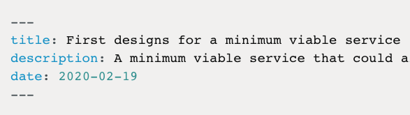

# Create a blank post

1. Create a new file in the app/posts folder. Files should be named using the format YYYY-MM-DD-slug.md, where:

YYYY is the year
MM is the month
DD is the day
slug is the text you want to appear in the URL

2. Add this at the top of the file and change relevant bits: 

3. Use markdown to style any content you want after this section. This is a good markdown cheatsheet https://github.com/adam-p/markdown-here/wiki/Markdown-Cheatsheet#lists

# Create a post with screenshots from a folder of images

1. Create a new folder within app/images.

2. Add images inside this folder. Screenshots will be generated in alphabetical order. If you want to have them appear in sequence, you can use numbered prefixes, ie. 01-index-page.png, 02-question-page.png.

3. In the terminal, type:

node scripts/generate.js [name-of-directory-holding-images]

This will generate an index page with screenshots listed in order, creating a post using the name of the containing folder. You can add other content after the images in markdown.
