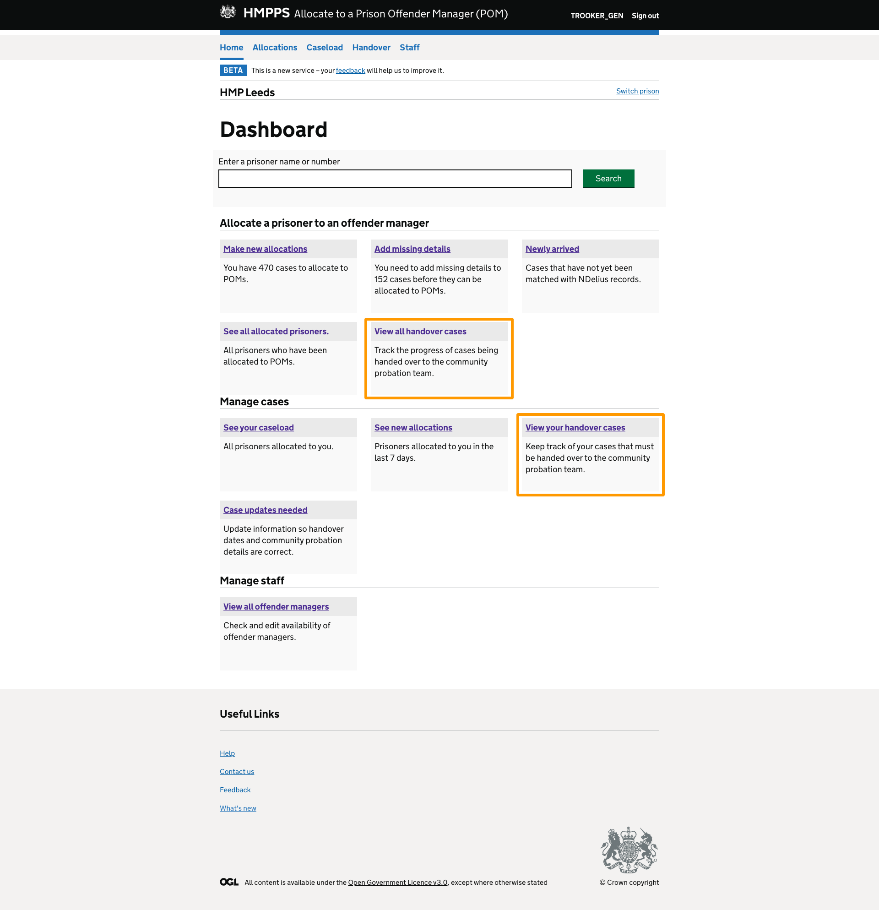

## Outline

The proposed design for a new handover feature in Manage POM cases has different views for POMs and HOMDs.

In each view, handovers are broken up across a set of tables with the intention of helping users keep track of their handover cases.

Additionally, POMs can mark specific handover tasks as completed on a task list, with progress visible in their own view, as well as to their manager.

A set of email reminders also flags important events in the handover process and the proposal is that POMs will be able to manage which of these emails they receive.

This post outlines UI behaviour that may not be properly reflected or immediately obvious in the prototype.

## How cases move through the tables

Both the POM view and the HOMD view share the same main tables. These are Upcoming handovers, Handovers in progress, Overdue tasks and COM allocation overdue.

* Cases appear on the Upcoming table 8 weeks before the COM allocation date
* They move from Upcoming to In progress on the date of COM allocation, even if a COM has not been allocated. If a COM is allocated early, the case should move to the In progress tab
* If a case is missing COM details 48 hours after the COM allocation date (or COM responisble date in indeterminate cases), it should remain on the In progress table. However, it should also be displayed on the COM allocation overdue table. Once a case is allocated a COM, it should be removed from this table. The 48 hours condition reflects a stiuplation in a service level agreement that states LDUs have this amount of time to allocate a COM.
* A case should stay on the In progress table until the release date is reached.

### Pagination 

Each table should display a maximum of 50 entries. If more than 50 entries need to appear, use pagination.

### Icons 

Google Drive: <a href="https://drive.google.com/drive/folders/1xaazuTPtd08X3ioAC6cPn5Hjif12gW0n?usp=sharing" target="_blank">Tick and cross icons </a>

### Overdue tasks table

Cases appear here if they have a red highlight applied. They also remain on the In progress table. See below for the rules that define when a red highlight should be applied to a case. 

## Content the tables should display

Most of the content of the tables is self-explanatory, but a couple of things may need a bit of clarification.

### COM responsible

This column contains information about the dates that responsibility passes to the community.

* Always show the date that the COM will become responsible
* If COM will support the case, show the date this will start above the COM responsible date

### Release date

POMs indicated it is useful to have release date type because it gives them a sense of how certain it is that someone will be released. For example, if someone is eligible for parole, it is less certain they will be released than someone who is not. It also allows them to work out when they should start communicating with the COM.

We should display one of the following types of release date on the tables. If a prisoner has more than one release date, display the earliest one. 

* CRD (Conditional release date)
* ARD (Automatic release date)
* HDCED (HDC eligibility date)
* HDCEA (HDC actual date)
* PED (Parole eligibility date)
* TED (Tariff expiry date)
* PRD (Parole review date)

Release date type should be followed by a colon and then the release date, like this:

ARD: 04 Jun 2021

### Local divisional unit (LDU) details

This one is in the COM allocation overdue tab.

1. If we have LDU name and email address, display both
2. If we don't have email address but we have LDU name, display this: "Check how to contact Swansea, Neath Port-Talbot LDU. We do not have an email address recorded for it."
3. If we don't have email address or LDU name, display this: "We don’t have this information. Check DPS to find where this person was sentenced and then try contacting the LDU for that area"

### Empty states

Show one of these messages in the relevant table for both POMs and HOMDs if there is no data to display:

* No upcoming handovers at the moment
* No handovers in progress right now
* No handover cases with overdue tasks 
* No handover cases missing COM details

<a href="https://hmpps-moic-staging.herokuapp.com/handover/final/pom/empty-state" target="_blank">See here in the prototype for an example.</a>

## Ordering information in the tables

POMs and HOMDs can choose to order the data in the table using the table headers. For example, they can order the information by POM name.

By default, however, the data should be ordered as follows:

* For HOMDs – Show cases with earliest COM responsible date towards the top of the table. If possible, also order by tier, so the higher tier cases are at the top of the table
* For POMs – Show cases with the earliest COM responsible date towards the top of the table

UR showed that HOMDs prefer to keep track of the higher tier cases, so bringing these up in the table will be useful. This is not as important for POMs.

## Table highlights

We use purple and red highlights on the tables to flag up important dates. The rules governing when highlights should be applied are the same across POM and HOMD views and are outlined below.

Orginally the purple highlight was green. We changed this to avoid suggesting that a handover has been completed once it turns green. In fact, there may still be work to do on the COM side or additional POM tasks that aren't included in our task list.

### If tasks are outstanding on a case that a COM has been supporting

* 21 days before COM becomes responsible: Case turns purple and the text "Handover due soon" is displayed
* On the day COM becomes responsible: Case turns red and the text "Handover tasks overdue" is displayed

### If tasks are outstanding on cases where COM becomes responsible on the day of allocation

* 14 days before COM allocation: Case turns purple and the text "Handover due soon" is displayed
* One week after COM allocation: Case goes red and the text "Handover tasks overdue" is displayed

### If COM allocation is overdue on any kind of case

* Case turns red if no COM has been assigned 48 hours after COM allocation date
* It stays red until a COM is allocated

## Handover task list

We show different tasks depending on the organisation that is supervising the case, as outlined in the handover policy.

If the case is an NPS case, show these tasks:

* Review OASys
* Have contact with COM
* Attend handover meeting

If the case is a CRC case, show these tasks: 

* Have contact with COM
* Send handover report

POMs can record progress on specific cases by ticking off tasks. Once a task's status is updated by a POM, this is reflected in the progress column in the HOMD view.

Eventually, there will be no difference between handovers for NPS and CRC cases and the first task list will need to be implemeted across the board.

## Link to EQuiP handover guidance

The POM view contains a sidebar with links to some handover guidance on EQuiP. The URL for this is: https://equip-portal.rocstac.com/CtrlWebIsapi.dll/?__id=docDetails.showDoc&doc=9AFC7FAAF4CA4B88BCCAEB9320C31F94&dpt=1

## Managing email reminders

While the email reminders were received well in UR, there is a need for users to be able to choose which emails they receive. Preferences chosen on the Manage email reminders page should apply to all cases.

## Handover reminder emails

Part of the feature involves sending reminder emails at important points in the handover process. <a href="https://docs.google.com/document/d/1VeXNQDZqQERde3MIfcCdxZTumza5UWPIWLcphSaOVfM/edit?usp=sharing" target="_blank">The content of each email is on this Google doc</a>.

This is when each email should be sent:

### 8 weeks before COM allocation

Send this email:

* For all types of case
* 8 weeks before date of COM allocation

### When a COM has been allocated

Send this email:

* For all cases
* On the date of COM allocation
* As long as COM has been allocated

### COM allocation overdue

Send this email:

* For all types of case
* 14 days after COM allocation
* If a COM has not been allocated

### To check handover tasks are in hand towards the end of the process

Send this email:

* For all types of case that have had a supporting COM
* 14 days before COM takes responsibility 
* If a COM has been allocated

### When a COM has become responsible 

Send this email:

* For all types of case that have had a supporting COM
* On the date that COM takes responsibility
* If a COM has been allocated

## Revised dashboard tiles

Following the implementation of this new feature, the handover tiles on the dashboard will need updating, as below.

This is because the current tiles state that we show cases that are within 30 days of handover to the community. In the new feature, we show cases that are within 8 weeks of handover, in line with user research findings.

