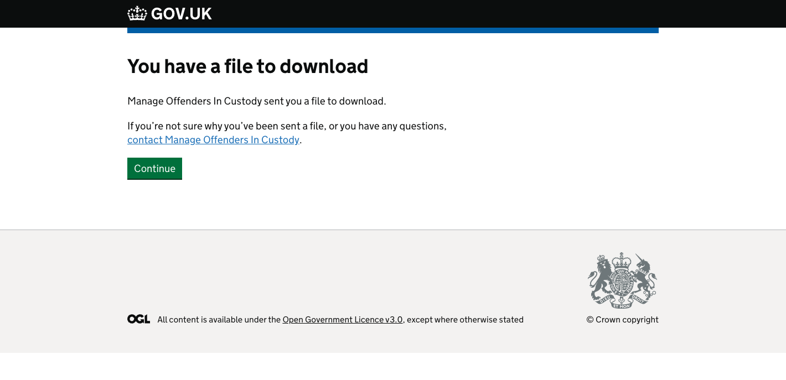
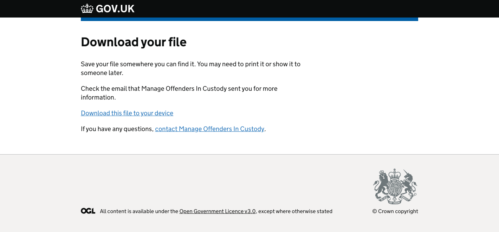

## Summary

MPC uses emails sent through Notify to support some of its functionality.

Most often, these are sent directly to the POM after a HOMD has done something like assign them a case or remove them from a case.

Elsewhere, some of the emails are sent to a shared mailbox at the Local Divisional Unit (LDU) to let the probation team know that some action is required.

This information records the trigger in the service that causes each email to be sent, as well as their main content and who receives them.

## Allocation

### New allocation

We send this to the POM when their HOMD has allocated a case to them through the service. It provides details of the prisoner and a link to their profile page in the service. 

If the HOMD chose to include a message to the POM when making the allocation, this will appear here.

### Reallocation

We send this to the POM after their HOMD allocates another POM to take over the case. The email contains the name of the prisoner who has been reallocated and their prison ID. It also gives the name of the POM that the case has been reallocated to and the name of the prison they work in.

### Remove allocation

This is sent to the POM after a prisoner has been transferred or released. It notifies the POM that they are no longer responsible for managing the case. 

### First allocation by prison

This is sent to members of the MPC service team when a prison makes its first allocation.

## Co-working notifications

### Allocate co-working POM

This is sent automatically to a POM after their HOMD has assigned them as the co-worker on a case. It contains details of the prisoner and the responsible POM they will be working with.

### Allocation of co-working POM to primary POM

This email notifies the responsible POM on a case that a co-working POM has been assigned to work with them. The message includes details of the prisoner and the name of the POM who will work on the case.

### Remove co-working POM

This goes to the primary POM to let them know a co-working POM has been removed from a case by a HOMD.

## Early allocation

### LDU: Eligible for early allocation (automatic)

This is sent to an LDU when a case is assessed to be automatically eligible for early allocation to the community.

A case is automatically eligible for early allocation if a POM answers yes to any of the questions on the first page of the early allocation form.

These questions cover things like if the prisoner was convicted of a terrorism-related offence or if they need to be managed at MAPPA level 3.

### LDU: May be eligible for early allocation (discretionary)

We send this to an LDU if the LDU or National Security Division needs to decide if a case is eligible for early allocation to the community. This is called discretionary eligibility.

A case has discretionary eligibility if a POM answers yes to any of the questions on the second page of the early allocation form in MPC. 

These questions aim to find out things like if the prisoner was managed by the Pathfinder Process or if they are at risk of serious harm.

Once they have made a decision, the LDU should contact the responsible POM directly to let them know the outcome. The POM then updates the prisoner's record in the service with the outcome.

### POM: Might be eligible for early allocation – needs reassessment 

The service sends this message to a POM if they completed an early allocation assessment more than 18 months before someone is due to be released. The assessment could have produced any outcome – automatic, discretionary or ineligible.

In this scenario, the assessment is saved but not sent to the LDU.

The message is sent once the person has less than 18 months until their release date. It reminds the POM to complete a new assessment form to see if the community should take responsibility for the case early.

## Responsibility override

### Case responsibility to community

We send this email to an LDU after a HOMD has applied an override to change responsibility for a case from custody to the community on the Allocation information page. For example, this could be because a prisoner has reached the end of their tariff and is no longer in the parole window, but responsibility has not changed to reflect this. Users also frequently change responsibility in error or because they think it will help them fix another problem.

This email notifies the community that a COM needs to be allocated to the case. It gives the prisoner's details and the reason for the change in responsibility, which the HOMD provides as part of the journey in the service.

### Case responsibility to custody – on POM allocated

The service sends this email after an override that has been applied to a case to change who is responsible for it is removed if no POM has been assigned to the case.

An override is applied when a HOMD selects the "change" link next to the Current case owner field on the Reallocate a POM page.

It could be that removing the override changes responsibility from community to custody.

However, this email will be sent any time an override is removed, even if the removal changes responsibility from custody to community.

### Case responsibility to custody – POM allocated 

As above, but this email is sent if a POM has been allocated to the case. It includes details of the POM that is responsible for the case.

## Handover

### Pipeline to community

This email goes out automatically to LDUs on the first of every month. It contains a list in CSV format of cases coming up for handover in the next 45 days, for example because they are approaching release or a parole review.  

We only send this if there are cases that the LDU will need to allocate to COMs. If there are no cases that require COM allocation, we send the Pipeline to community (no offenders) email.

LDUs access the list of cases through the onward journey that starts from a link in the body of the email and which is shown in the screens below.

Once the list of cases has been downloaded, COMs can be assigned through NDelius.

### Pipeline to community (no offenders)

As above, but we send this when there are no cases for the LDU to assign COMs to.

### Pipeline to community urgent

The service sends this one to the LDU's functional mailbox if a case hasn't been allocated a COM one week after the start of handover.

This is sent for each case that has not been allocated by this stage – it's not a bulk email, in contrast to the Pipeline to the community email.

It includes details of the prisoner and handover information such as start date and the date that responsibility is due to change.

## COM allocation requests

### Under 10 months – COM allocation required 

We send this after NOMIS has done a sentence calculation on a case that has just entered the service and determined that the prisoner has less than 10 months to serve on their sentence. For example, this might be because they have already served a number of months on remand before starting a custodial sentence.

This means that OMIC rules will not apply to the case and a POM will need allocating in a supporting role only, with a COM taking responsibility.

This email goes to the LDU's functional mailbox and asks them to allocate a responsible COM. 

### LDU: Supporting COM needed after move to open prison

The service sends this email to an LDU after a prisoner moves to open conditions. For example, this could happen following a parole review or if the prisoner has been successful in a pre-tariff sift.

In the men's estate, this means they physically move to a prison we know to operate under open conditions. Female prisoners stay in the same location, but move to a different wing. We look at their category to tell if they are now in open conditions.

In the email we give details of the case and tell the LDU that they need to allocate a COM to support the POM.

## Drafts

### Unsuccessful match with NDelius

This asks the community to update an NDelius record in the event of an error so our service can match the prisoner to a record in NOMIS.

The service doesn’t have the functionality to support this at the moment.

## Archive

### Women’s prison: ISP COM supporting required

We sent this to ask the probation team to allocate a supporting COM after a female prisoner had moved to open conditions.

Separately, we sent LDU: Supporting COM needed after move to open prison when a male prisoner had moved to open conditions.

We archived this email after merging these 2 messages.

Now, we only send LDU: Supporting COM needed after move to open prison for both male and female prisoners on an indeterminate sentence in this scenario.

