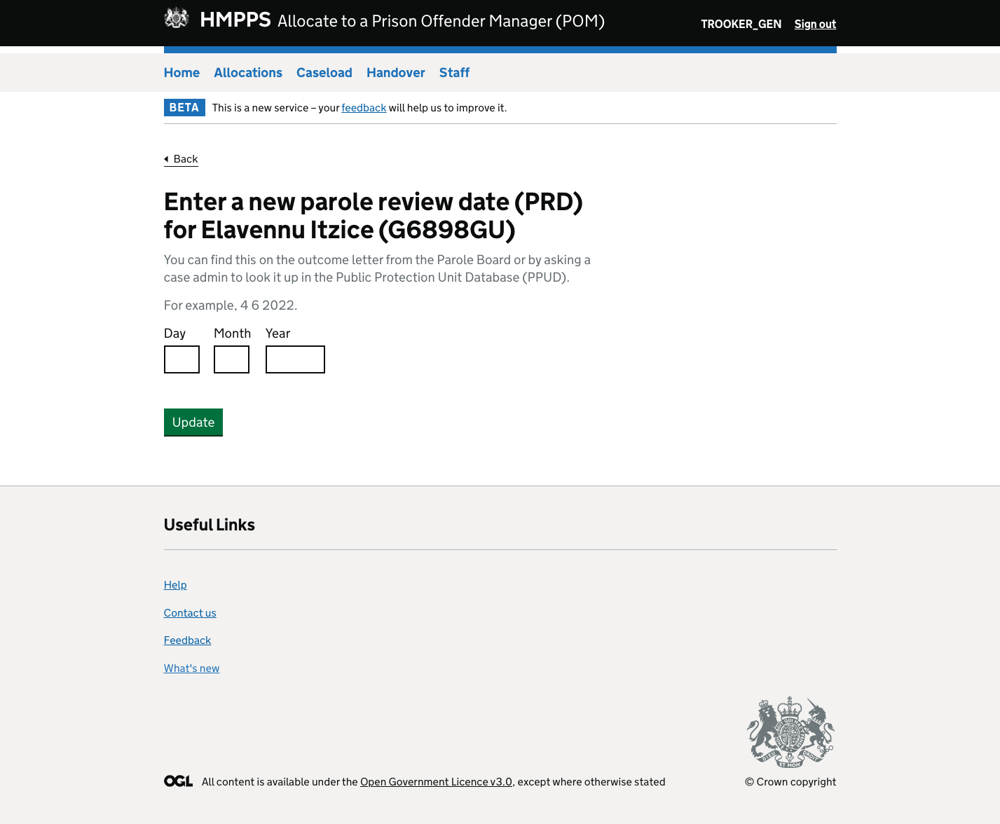

<a href="https://docs.google.com/document/d/1PnoLn23jEmuq_kkxh3GtstCSLlB3keeqSlne_qo-f0s/edit?usp=sharing" target="_blank">See also Parole investigations so far</a>

## Information the service requires

MPC needs to know the date of someone’s next parole hearing if the Parole Board decides they will not be released.

This allows the service to calculate if responsibility for the case should remain with the community or move to custody.

### How the service gets this information at the moment

Currently, MPC asks the user to manually enter something we call a “parole review date” as soon as it passes using this screen:

However, it has transpired that users do not actually use or understand the term “parole review date”. It doesn’t seem to be used in any part of the parole process or in PPUD, the database that stores information about parole cases that is managed by a company called Lumen.

OMIC policy subsequently decided the relevant date to use is the next target oral hearing date. This is communicated to people involved in the parole application in an outcome of Parole Board decision letter and in the target hearing date field of PPUD.

Another problem here is that MPC requests the new date as soon as the current one passes. This is despite the fact that the new date will not be available for several weeks and only if the person is not recommended for release. This means there is quite a long period where users could enter the wrong information. 

## What is changing

Two pieces of design work have been completed on the parole part of MPC, which will be implemented in 2 releases.

In the first release, the current manual entry process will be replaced with a new journey in which the correct date is requested with some additional guidance to make it easier to choose the right date.

In the second release, the manual entry journey will be removed and the target hearing date will be taken directly from PPUD.

In addition, we will take these 2 pieces of data from the system:

* Hearing outcome
* Submission deadline for custody report

We hope displaying this information in the service will make it easier for POMs and HOMDs to keep track of parole cases.

Not all POMs have access to PPUD so they have to ask someone to check things for them. Saving them this job frees them up and means they can quickly keep track of when things are happening.

For HOMDs we think this will help with workload management – for example, they can see when a report is due and know they will probably have to review and countersign it before it’s submitted. They might also be able to plan to accompany a POM to a hearing or arrange for someone else to go with them.

## Release 1 – the new manual entry journey

### What is in the design

<a href="https://hmpps-moic-staging.herokuapp.com/" target="_blank">The new design is recorded as a prototype here</a> under Parole manual entry – final design (username MOIC / password elephants). 

#### New pages to create

* <a href="https://hmpps-moic-staging.herokuapp.com/parole/pom/manual-entry-v3/outcome-of-parole" target="_blank">What was the outcome of this person’s parole application?</a>
* <a href="https://hmpps-moic-staging.herokuapp.com/parole/pom/manual-entry-v3/target-hearing-date-announced" target="_blank">Has this person’s next target hearing date been announced?</a>
* <a href="https://hmpps-moic-staging.herokuapp.com/parole/pom/manual-entry-v3/check-if-target-hearing-date-needed" target="_blank">Check if you need to enter a new target hearing date</a>
* <a href="https://hmpps-moic-staging.herokuapp.com/parole/pom/manual-entry-v3/enter-next-target-hearing-date-no-help" target="_blank">Enter the next target hearing date (no help link)</a>

#### Summary of updates required to existing pages

<a href="https://hmpps-moic-staging.herokuapp.com/parole/pom/manual-entry-v3/prisoner-profile" target="_blank">View case information</a>

* Change content of update banner
* Change content of success banner once update has been made – <a href="https://hmpps-moic-staging.herokuapp.com/parole/pom/manual-entry-v3/prisoner-profile-success" target="_blank">see prototype here</a>. This success message should disappear when user navigates away from this page or refreshes it
* Change target hearing date field in line with prototype
* Add Next target hearing date field as described by rules below

<a href="https://hmpps-moic-staging.herokuapp.com/parole/pom/manual-entry-v3/case-updates-needed" target="_blank">Case updates needed</a>

* Add text underneath H2
* Change text in Update needed and Action columns

<a href="https://hmpps-moic-staging.herokuapp.com/parole/pom/manual-entry-v3/enter-next-target-hearing-date" target="_blank">Enter this person’s next target hearing date</a>

* Could update the existing parole review date page pictured above with the new content shown in the prototype

### Rules for displaying information 

We would like to ask the user to enter the new date 6 weeks after the person’s current parole review date or target hearing date passes. This brings the service more closely into line with the parole process, in which the new date is not made available until 21 days after the hearing outcome has been shared.

At this point, the case should move on to the Case updates needed page. The person’s profile page should also be updated with a banner requesting the new date and some changes to the fields in the Sentence section. 

These are the rules we would like these fields to follow:

* Always show PED/TED
* If someone has an upcoming target hearing date – only show that in the “Target hearing date” field 
* If the target hearing date has passed – wait 6 weeks, then show the “Next target hearing date” field in addition to the "Target hearing date" field 
* Once update is made – only show “Target hearing date” field with the new date (remove “Next target hearing date” field)
* Remove the field if someone is no longer eligible for parole

After the new target hearing date has been entered, the case should be removed from the Case updates needed page. The banner on the profile page that asks for the target hearing date to be updated should also be removed. 

This banner also appears on the caseload page:

This should be removed on the updated caseload page, which has a clearer way of showing if case updates are needed.

If the person is released, they should be removed from the service as normal.

## Release 2 – taking target hearing date from PPUD

### What is in the design

<a href="https://hmpps-moic-staging.herokuapp.com/" target="_blank">The design for the second release is recorded here</a> under the header Parole (username MOIC / password elephants).

#### Pages and components to remove

This design replaces the one for the first release, meaning a number of things from the manual entry journey need removing. These are:

* Delete <a href="https://hmpps-moic-staging.herokuapp.com/parole/pom/manual-entry-v3/enter-next-target-hearing-date" target="_blank">Enter this person’s next target hearing date page</a>
* Remove the following question and guidance pages: 
    - <a href="https://hmpps-moic-staging.herokuapp.com/parole/pom/manual-entry-v3/outcome-of-parole" target="_blank">What was the outcome of this person’s parole application?</a>
    - <a href="https://hmpps-moic-staging.herokuapp.com/parole/pom/manual-entry-v3/target-hearing-date-announced" target="_blank">Has this person’s next target hearing date been announced?</a>
    - <a href="https://hmpps-moic-staging.herokuapp.com/parole/pom/manual-entry-v3/check-if-target-hearing-date-needed" target="_blank">Check if you need to enter a new target hearing date</a>
    - <a href="https://hmpps-moic-staging.herokuapp.com/parole/pom/manual-entry-v3/enter-next-target-hearing-date-no-help" target="_blank">Enter the next target hearing date (no help link)</a>
* Stop showing parole cases on the <a href="https://hmpps-moic-staging.herokuapp.com/parole/pom/manual-entry-v3/case-updates-needed" target="_blank">Case updates needed page</a>
* Remove <a href="https://hmpps-moic-staging.herokuapp.com/parole/pom/manual-entry-v3/prisoner-profile" target="_blank">target hearing date update banner from profile page</a>
* Remove <a href="https://hmpps-moic-staging.herokuapp.com/parole/pom/manual-entry-v3/prisoner-profile-success" target="_blank">success message from the profile page</a>
* Remove Next target hearing date field from the <a href="https://hmpps-moic-staging.herokuapp.com/parole/pom/manual-entry-v3/prisoner-profile" target="_blank">profile page</a>

#### New parole tables

One of the main features of the design is a table that lists parole cases. This is shown <a href="https://hmpps-moic-staging.herokuapp.com/parole/pom/parole" target="_blank">here for POMs</a> and <a href="https://hmpps-moic-staging.herokuapp.com/parole/homd/parole" target="_blank">here for HOMDs</a>.

In the HOMD view, this should show all the parole cases in the prison. For POMs, it should show all parole cases on their caseload.

These are the rules for when cases should appear and disappear from the tables:

* A case should appear on the table 10 month before parole eligibility date, tariff expiry date or target hearing date
* Remove a case if someone is unsuccessful for parole and their next target hearing date is more than 10 months away
* Remove a case if someone is released 

#### New parole section on the profile page

We want to show the new data from Lumen in a new parole section on each of the profile pages (View prisoner information in both the POM and HOMD views, Allocate a POM and Reallocate a POM).

This section should only be displayed for parole cases – ie ones that have either a tariff expiry date, parole eligibility date or target hearing date.

* Parole eligibility date, tariff expiry date and target hearing date should be moved into this new section
* Once someone’s target hearing date passes, show the hearing outcome field. Display the text “No hearing outcome recorded yet” until PPUD sends the outcome
* We think Lumen will send us one of the following hearing outcomes:
    - Compassionate release
    - No release
    - Open – exceptional circumstances
    - Open conditions – accepted
    - Open conditions – rejected
    - Oral hearing – release
    - Paper decision – release
    - Parole Board no recommendation
    - Parole Board release immediately
    - Recommend release
    - Release
    - Release at CRD (EDS/SOPC)
    - Stay in closed
    - Stay in open

This data may need manipulating to ensure it is formatted consistently with the rest of the service content.
* If someone is unsuccessful at their parole hearing, record the target hearing date month and year and the hearing outcome in the previous parole applications section. Record up to 3 hearing outcomes in this section.